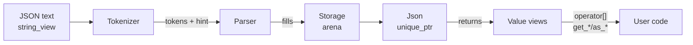
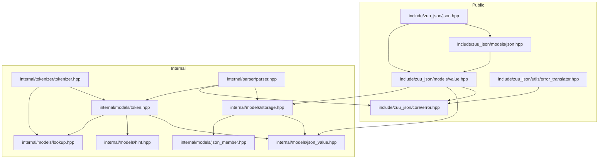
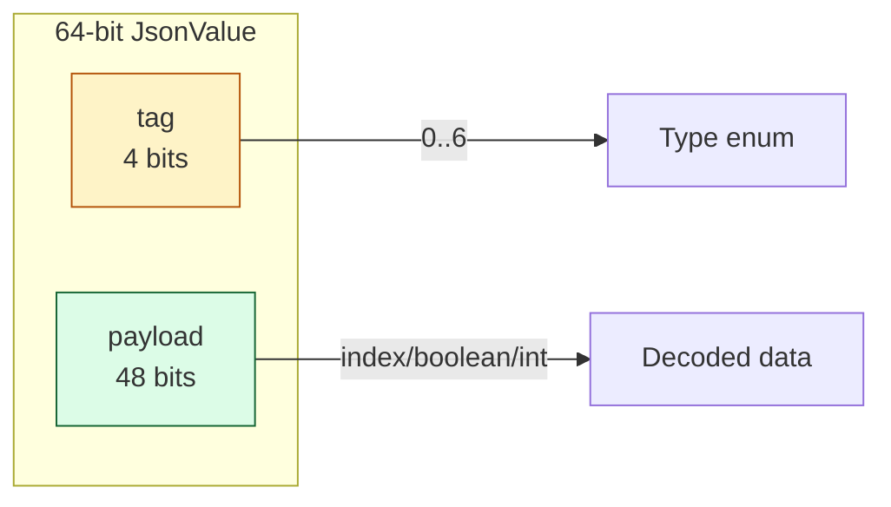
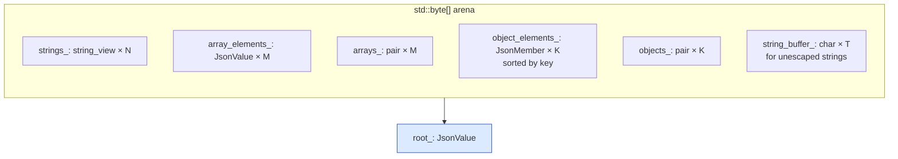
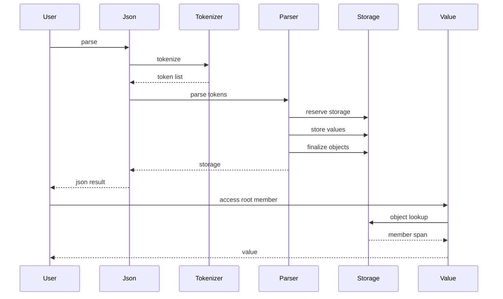
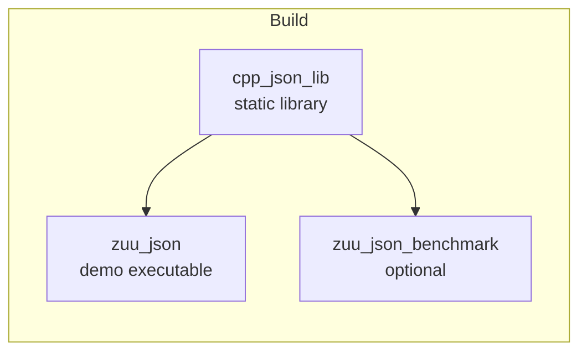

# Architecture

This document describes the internal design of `zuu_json`: the modules, their responsibilities, the data flow from raw text to a queryable DOM, and the rationale for the major design choices.

## High-level overview

`zuu_json` is a single-pass, exception-free JSON parser that materializes a compact DOM into an arena. The pipeline is `Tokenizer → Parser → Storage`, and the user-facing API is built on top of `Storage` through `Json` and `Value`.

The three stages are independent in the public API (`Tokenizer::Tokenize`, `Parser::Parse`) but the convenient entry point is `Json::parse`, which composes all three.

## Module layout

| Layer               | Files                                                                                              | Notes                                                                                                 |
| ------------------- | -------------------------------------------------------------------------------------------------- | ----------------------------------------------------------------------------------------------------- |
| **Public surface**  | `include/zuu_json/**`                                                                              | Installed for downstream users. Only `Json`, `Value`, `JsonError`, and `TranslateError` are exported. |
| **Internal models** | `internal/models/**`                                                                               | Plain data: `JsonValue`, `JsonMember`, `Token`, `Hint`, `Lookup<Token>`. Not installed.               |
| **Tokenizer**       | `internal/tokenizer/**` + `src/tokenizer.cpp`                                                      | Lexer; emits a `std::vector<Token>` and a `Hint<Token>`.                                              |
| **Parser**          | `internal/parser/**` + `src/parser.cpp`                                                            | Recursive-descent parser; fills a `Storage`.                                                          |
| **Storage**         | `internal/models/storage.hpp` + `src/storage.cpp` + `src/models/json.cpp` + `src/models/value.cpp` | The arena-backed DOM and the access logic.                                                            |

## The type-tagged value (`JsonValue`)

Every JSON value — primitive, string, array, or object — is stored as a single 64-bit word.

**Encoding rules**

- A `Double` is stored as its raw IEEE-754 bit pattern. The presence of the NaN-boxed tag bits is detected by `is_double()`, which checks that the high 12 bits are **not** all 1s.
- All other types use a NaN-boxed pattern: the high 12 bits are `0x7FF8` (a quiet-NaN marker), the next 4 bits carry the type tag, and the low 48 bits carry the payload (boolean bit, integer value, or index into strings/arrays/objects).
- This packing lets a `JsonValue` fit in a register, lets `get_type()` be a couple of bit ops, and lets the arena store everything in one tight span.

## The arena (`Storage`)

`Storage` is a single contiguous byte buffer that owns every allocation the parser produces. There is **no per-string or per-array heap allocation** during parsing.

| Sub-region         | Contents                                                                                                      | Growth policy                                |
| ------------------ | ------------------------------------------------------------------------------------------------------------- | -------------------------------------------- |
| `strings_`         | One `std::string_view` per interned string (zero-copy pointers into the source text or the `string_buffer_`). | Hint-driven reservation.                     |
| `array_elements_`  | Sequential `JsonValue`s for each array being built.                                                           | Bump.                                        |
| `arrays_`          | Pairs of `(offset, length)` into `array_elements_`.                                                           | One per array.                               |
| `object_elements_` | `JsonMember` = `(key_index, value)`. **Sorted by key on seal.**                                               | Bump; sorted in `sealObject` for `size > 1`. |
| `objects_`         | Pairs of `(offset, length)` into `object_elements_`.                                                          | One per object.                              |
| `string_buffer_`   | Mutable scratch for unescaped string contents.                                                                | Bump.                                        |

The hint computed by the tokenizer (`Hint<Token>`: string/array/object/comma counts + escape byte count) lets the arena pre-reserve all six sub-regions up front, so parsing does no reallocation.

**Cache-line alignment.** The backing `std::byte[]` is over-allocated by `cache_line_size - 1` bytes so the base can be rounded up to a cache-line boundary before the sub-region pointers (`strings_`, `array_elements_`, …) are carved out. Without this padding, the base address returned by `std::make_unique_for_overwrite<std::byte[]>` is unaligned, and a later cast to `std::string_view*` (or any larger type) would be UB on platforms that require aligned loads.

### Sorted object members

When an object is sealed via `Storage::sealObject(start_offset)`, its members are sorted by key. The sort is skipped when `size <= 1` to avoid overhead on trivial objects. The sort enables **O(log N) binary search** for `operator[]` and `contains()`.

## The pipeline

### Tokenizer

A single pass that emits `Token` records. It uses a 256-entry lookup table (`Lookup<Token>::value`) keyed by byte, which lets the dispatch be a single table load — branch-predictor friendly. Whitespace scanning uses a SWAR technique (SIMD-Within-A-Register) to skip runs of whitespace in 8-byte chunks. The tokenizer also produces a `Hint<Token>` that drives arena reservation.

### Parser

Recursive-descent. Owns a `Storage`, a `current_` pointer into the token stream, and an `end_` pointer. Decoding steps:

- Unescaping writes into `string_buffer_` and returns a `string_view` into it; the view is then interned into `strings_` by `commitString`.
- Numbers: integer if representable in 48 bits, otherwise promoted to `double` (stored as its raw bits).
- Unicode escapes are decoded and validated; invalid surrogates and code points return `InvalidSurrogate` / `InvalidUnicode`.
- Arrays and objects are built via the bump allocator: `sealArray` / `sealObject` close the current container and return its index.
- `sealObject` additionally **sorts members by key** when the container has more than one entry.

### User-facing access (`Json`, `Value`)

- `Json` owns a `std::unique_ptr<Storage>` and exposes `parse`, `root`, and `operator[]`.
- `Value` is a non-owning view: a `(Storage*, JsonValue)` pair. Copies are cheap.
- Object lookup uses `std::lower_bound` over the sorted members, with a comparator that dereferences the key index through `Storage::string`. Lookup is O(log N) on key compare count; full string equality is only checked once after `lower_bound` returns.

## Error model

`JsonError` is an `enum class : unsigned char`. Every fallible call returns `std::expected<T, JsonError>`. There are no exceptions on the library side, so a malformed document cannot crash the caller via a missed handler.

| Category   | Examples                                                   |
| ---------- | ---------------------------------------------------------- |
| Lexical    | `SingleQuotedString`, `UnquotedKey`, `LeadingZero`         |
| Structural | `MissingComma`, `TrailingComma`, `EmptyValue`              |
| Type       | `IsNotArray`, `IsNotObject`, `InvalidType`                 |
| Escape     | `UnescapedCharacter`, `InvalidUnicode`, `InvalidSurrogate` |
| Lookup     | `InvalidValue` (also returned for a missing object key)    |

`zuu::utils::TranslateError` provides a `const char*` description for each value.

## Performance techniques

| Technique                                      | Where                                                      | Why it helps                                                                                                                                                                          |
| ---------------------------------------------- | ---------------------------------------------------------- | ------------------------------------------------------------------------------------------------------------------------------------------------------------------------------------- |
| Lookup table (`Lookup<Token>`)                 | Tokenizer dispatch                                         | One table load per byte; no branch.                                                                                                                                                   |
| SWAR whitespace scan                           | Tokenizer loop                                             | Skips up to 8 bytes per iteration.                                                                                                                                                    |
| Bump-allocated arena                           | `Storage`                                                  | No per-token allocation; arena grows in big chunks.                                                                                                                                   |
| Hint-driven reservation                        | `Storage` ctor                                             | Eliminates reallocations during parsing.                                                                                                                                              |
| Cache-line aligned sub-regions                 | `Storage` ctor                                             | Over-allocates `cache_line_size - 1` bytes so the cast to `std::string_view*` / `JsonValue*` etc. lands on a cache line. Avoids misaligned-load UB and false sharing between regions. |
| Type-tagged 64-bit `JsonValue`                 | Everywhere                                                 | Single-word values; type checks are bit ops.                                                                                                                                          |
| **Sorted object members + `std::lower_bound`** | `Json::operator[]`, `Value::operator[]`, `Value::contains` | **O(log N) object key lookups.**                                                                                                                                                      |
| `-O3 -march=native` + IPO/LTO                  | Release build                                              | Whole-program optimization.                                                                                                                                                           |

## Concurrency

A parsed `Json` document is read-only. Concurrent reads across threads are safe as long as the `Json` outlives every thread that holds a `Value` view into it. There is no internal locking; the cost of an atomic load on the storage pointer is paid via the natural memory ordering of `std::unique_ptr::get()`.

## Build-time boundaries

The library is delivered as a single static archive, `cpp_json_lib`. The demo and the benchmark binary both link against it. See [../BUILD.md](../BUILD.md) for configuration.

## Benchmark layout

The benchmark suite is split into per-domain files under `tests/`:

| File                | Concern                                                                                 |
| ------------------- | --------------------------------------------------------------------------------------- |
| `bm_main.cpp`       | `main()` — Google Benchmark `Initialize` / `RunSpecifiedBenchmarks` / `Shutdown`.       |
| `bm_tokenizer.cpp`  | Lexical analysis: `Tokenizer_<Sample>` over every sample fixture.                       |
| `bm_parser.cpp`     | Recursive-descent parser: `Parser_<Sample>` over real samples.                          |
| `bm_pipeline.cpp`   | End-to-end `Json::parse` throughput: `Pipeline_<Sample>`.                               |
| `bm_storage.cpp`    | Micro-benchmark: arena vs `std::vector`-based storage, ranged over element counts.      |
| `bm_dom.cpp`        | DOM traversal / object-lookup / deep-chained access.                                    |
| `bm_strings.cpp`    | String-heavy samples: tokenizer and parser runs on escaped / plain string data.         |
| `bm_number.cpp`     | Number parsing: `ParseInt_Zuu` vs `ParseInt_StdFromChars`, same for `Double`.           |
| `bm_error_path.cpp` | Adversarial inputs (deep nesting, trailing commas, unquoted keys) and a valid baseline. |

Sample loading is centralised in `internal/utils/fs_util.hpp` (`zuu::tests::utils::get_sample_path`, `load_sample`). The helper walks up to four parent directories looking for `samples/<filename>` so the benchmark works regardless of the build directory.
