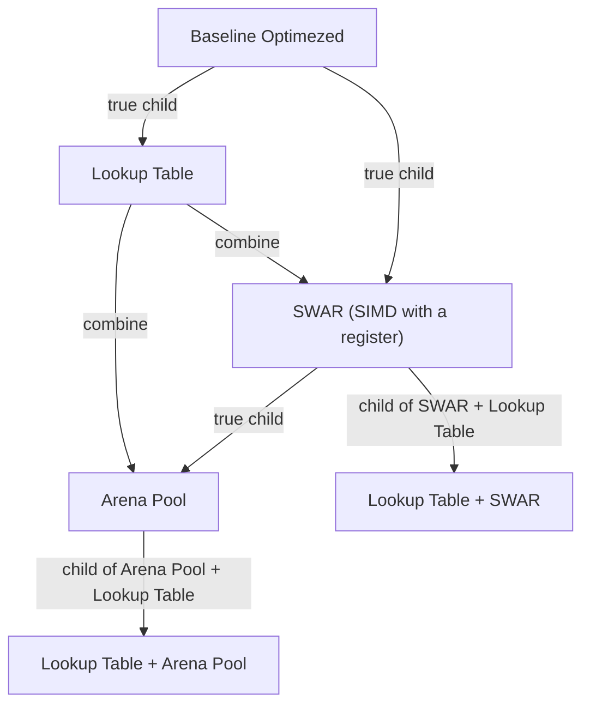

# METHOD
| Code | Name Method | Impact |
|---|---|---|
| M001 | Baseline Optimized | standard optimized |
| M002 | Lookup Table | good for branch prediction |
| M003 | SWAR (SIMD with a register) | good for batch processing |
| M004 | Arena Pool | good for storing processed data |
| M005 | Lookup Table + SWAR | |
| M006 | Lookup Table + Arena Pool | |

# DEPENDENCIES

